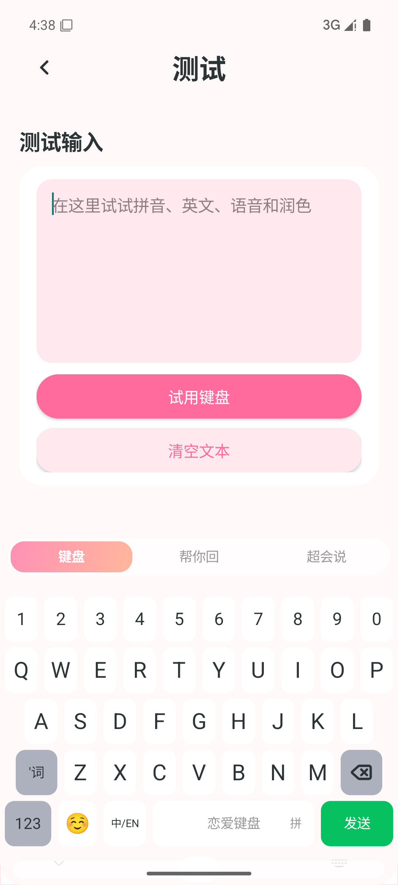
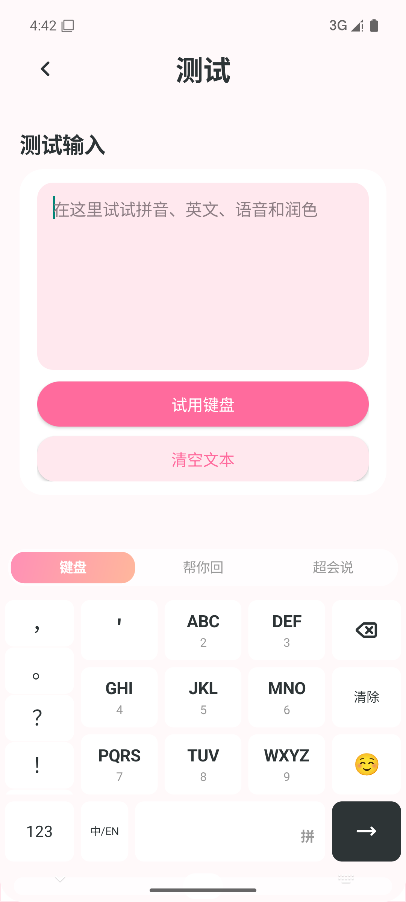
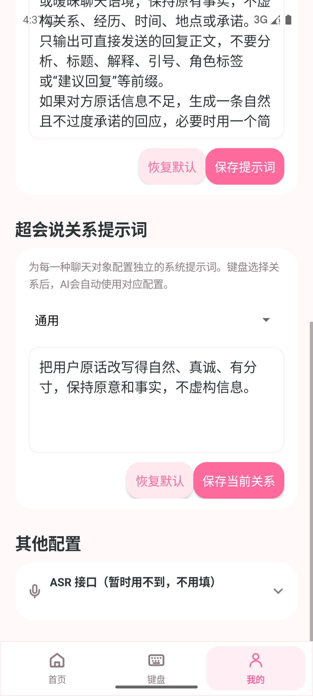

# 恋爱键盘（LianAi Keyboard）

<p align="center"></p>

<p align="center">一款面向 Android 的开源 AI 恋爱输入法：正常打字，也能帮你回、帮你说。</p>

<p align="center">
  <a href="https://github.com/1213109176kgy-png/LianAi-Keyboard/releases/latest">下载最新版</a> ·
  <a href="README.md">English</a> ·
  <a href="LICENSE">GPL-3.0-or-later</a> ·
  <a href="PRIVACY.md">隐私说明</a>
</p>

> 当前版本：**v1.4.8**。最低支持 Android 13（API 33），当前提供 arm64-v8a 安装包。

## 项目简介

恋爱键盘由“键盘管理 App + Android 输入法”组成。用户可以使用 26 键或九宫格进行离线中文输入，也可以在聊天时调用自己配置的大模型生成三条回复建议、分析对方情绪，或优化自己准备发送的话。

项目不绑定固定模型厂商。文本模型支持 DeepSeek、Kimi、通义千问、豆包、硅基流动等预设，也支持用户填写 OpenAI Chat Completions 兼容接口地址、模型名和 API Key。API Key 使用 Android Keystore 加密保存，不会提交到本仓库。

## 主要功能

- **基础输入法**：26 键拼音、九宫格拼音、英文、数字、符号、Emoji、候选词、删除与光标编辑。
- **帮你回**：粘贴对方的话，分析情绪并生成三条可点击使用的回复；支持重新分析。
- **超会说**：先在键盘内部输入草稿，一键优化为三条备选话术，再选择写入聊天输入框。
- **关系提示词**：通用、心动对象、恋人、朋友、家人、同事、客户、上司等关系可分别配置系统提示词。
- **多模型配置**：选择厂商、接口类型、API 地址、Key 和模型；支持自定义兼容接口。
- **本地优先**：拼音与基础候选离线运行；剪贴板历史、听写历史默认关闭。

## 界面截图

<p align="center">
  
  
  
</p>

## 安装与使用

1. 前往 [GitHub Releases](https://github.com/1213109176kgy-png/LianAi-Keyboard/releases/latest) 下载 v1.4.8 APK。
2. 安装后打开“恋爱键盘”，按照首页四步引导启用并切换输入法。
3. 进入“我的 → 设置 → 大模型配置”，选择文本模型厂商并填写接口地址、模型和 API Key。
4. 在微信、短信或其他应用中点击输入框，切换到恋爱键盘即可使用。

ASR 语音接口当前不是必填项，默认折叠；只使用文字键盘、“帮你回”和“超会说”时无需配置。

## 大模型配置示例

以 DeepSeek 为例：选择 DeepSeek 厂商，使用应用预设的官方地址或填写兼容接口地址，模型可填写账号支持的 `deepseek-chat`，最后填写自己的 API Key。

请勿在 Issue、截图或聊天记录中公开 API Key。调用费用和内容政策由你所选择的模型服务商决定。

## 本地构建

环境要求：JDK 17、Android SDK 35、NDK 26.1、Gradle 8.7。

```powershell
$env:JAVA_HOME='C:\path\to\jdk17'
gradle :app:testDebugUnitTest :app:assembleDebug --no-daemon
adb install -r .\app\build\outputs\apk\debug\app-debug.apk
```

公开发布前运行 `gradle verifyOpenSourceRelease lintDebug --no-daemon`。

## 隐私与安全

- 密钥由 Android Keystore 保护，不写入源码、构建参数或日志。
- 拼音词典和基础候选在本机运行。
- 只有主动点击 AI 功能时，相关文本才会发送到用户配置的模型接口。
- 请勿在密码、验证码、银行卡等敏感输入框中使用 AI 功能。
- 完整数据边界见 [PRIVACY.md](PRIVACY.md)，安全问题请参照 [SECURITY.md](SECURITY.md)。

## 开源许可与致谢

本项目基于 Vertick IME 进行二次开发，并使用 Trime/librime、Rime-Ice、cppjieba、Lucide 等开源项目。项目依据 [GNU GPL v3 or later](LICENSE) 开源；第三方项目、版本及许可证详见 [THIRD_PARTY_NOTICES.md](THIRD_PARTY_NOTICES.md)。

欢迎提交 Issue、功能建议和 Pull Request。二次分发或修改时，请继续遵守 GPL 及第三方组件许可证。

## 开发者与交流

开发者：**邝广元（广东 · 深圳）**

欢迎扫码添加微信好友，交流使用体验、功能建议或参与开发。

<p align="center"></p>

## 随缘打赏

如果这个项目对你有帮助，欢迎随缘打赏。打赏完全自愿，不影响软件功能、更新或开源许可。

<p align="center"></p>

---

请只从本项目官方 GitHub/Gitee 仓库下载 APK，并在安装前核对 Release 页面公布的 SHA-256。
